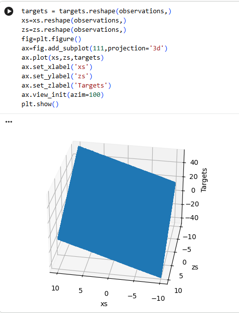
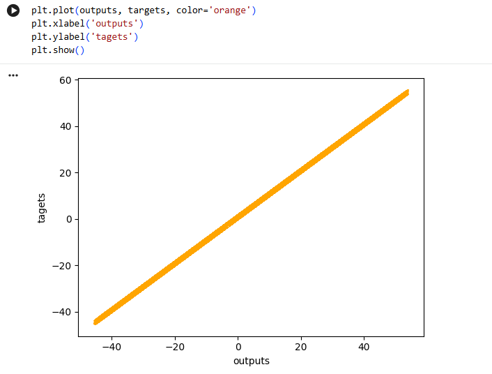
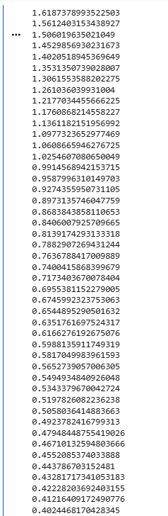
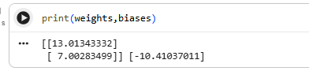
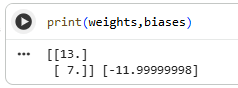
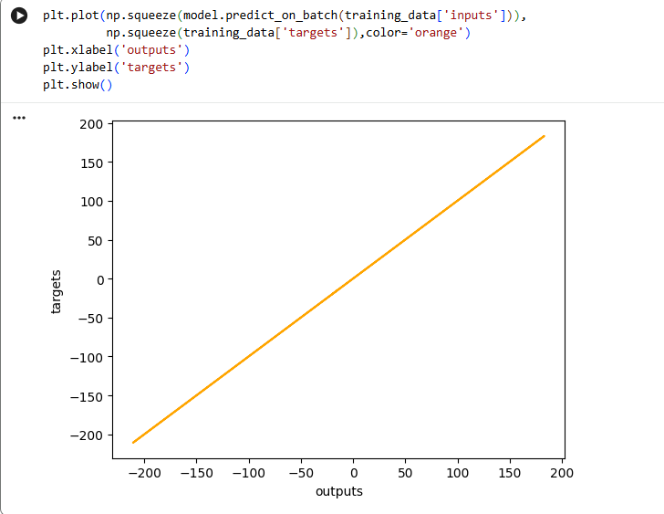
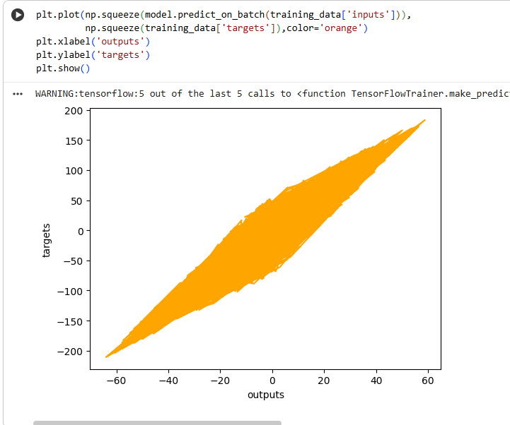
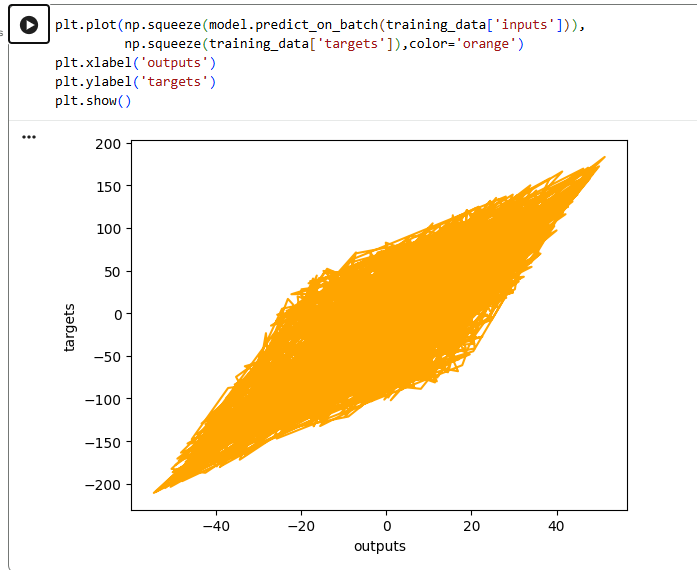
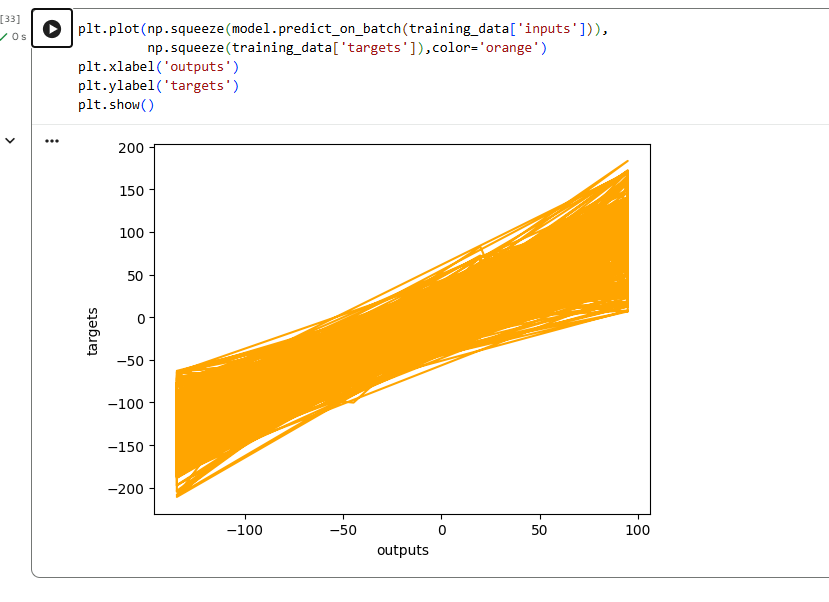

# Laboratorium-nr-1-model-linowy
Jakub Błazko SI lab1
# 1.Zmiana ilości próbek:
## Po zmianie z 1000 próbek początkowych na 1000000 (milion) program wyrzuca błąd z faktu na zbyt dużą ilość próbek.
### Wartość która jest w stanie się uruchomić używając możliwości sprzętowych Google Colab, to 400000 (czterysta tysięcy)
## KOD:
` observations=400000
xs=np.random.uniform(low=-10,high=10,size=(observations,1))
zs=np.random.uniform(low=-10,high=10,size=(observations,1))
inputs=np.column_stack((xs,zs))
print(inputs.shape) `

--
2.
a) Zmiana eta z 0.2 na 0.0001 skutkuje spowolnieniem nauki, potrzebne jest o wiele więcej epok by nauka przebiegła skutecznie
b) Zmiana eta z 0.2 na 0.001 skutkuje spowolnieniem nauki, względem eta 0.0001 eta 0.001 uczy się szybciej i wymaga mnie epok
c) Zmiana eta z 0.2 na 0.01 skutkuje spowolnieniem nauki, względem eta 0.001 eta 0.01 uczy się szybciej i wymaga mniej epok, jest mu o wiele bliżej wydajności eta 0.2, 
W każdym z przypadków by osiagnąc skuteczą nauke należy zmienić ilość epok z 100 na większą
 --
 3.Zmiana targets na np. targets = 13 * xs + 7 * zs – 12 dało zbliżone liczby, jedyna większa różnica w liczbach była z -12, poniważ dało wiekszą liczbe -10 
 
 Zwiększenie epok na 1000 z 100 skutkuje prawie idealnym wynikiem:
 
 --
 --
 # Laboratorium-nr-2-model-liniowy
 ### Bazowy wykres
 
--
## Zadanie 1
1.Zmiana z sgd na adam odbiega od oczekiwanych wyników, adam w optimizer wymaga większej ilości epok by wynik był satysfakcjonujący(z 100 na 1000 epoch)

2.Zmiana z loss mean_squared_error na mean_absolute_error odbiega od oczekiwanych wyników, absolute w loss wymaga większej ilości epok by wynik był satysfakcjonujący(z 100 na 1000 epoch)
3.kombinacja zmian również pokazuje to że jest wymagana większa ilośc epok do osiągnięcia satysfakcjonującego wyniku nauki

## Zadanie 2
1.po dodaniu przykładowych warstw sigmoid wynik wygląda tak:
